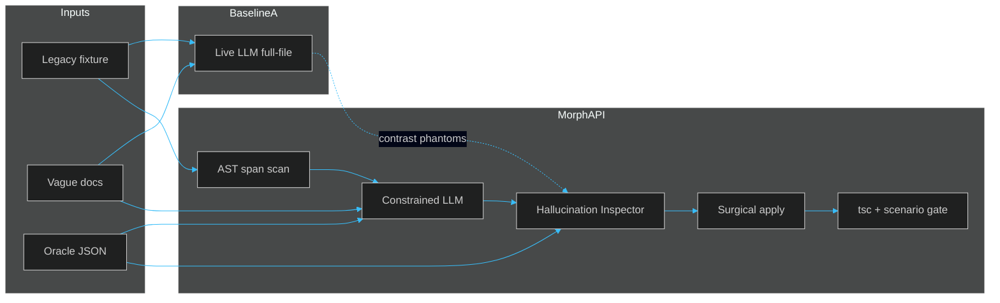

<div align="center">

[](https://github.com/itzsihui/MorphAPI)

[](https://www.typescriptlang.org/)
[](https://platform.openai.com/)
[](./docs/evaluation.md)
[](#demo)

**Hybrid AI + AST agent for self-maintaining API migrations.**

Pure LLMs invent near-miss scaffolding that looks right and fails `tsc`.
Pure ASTs cannot invent new business logic. MorphAPI couples both — with an oracle that illegal symbols never pass.

[Why](#why-morphapi-exists) · [How it works](#how-a-migration-works) · [Architecture](#architecture) · [Setup](#setup) · [Demo](#demo) · [Evaluation](#evaluation)

</div>

---

## Why MorphAPI exists

API drift is constant: Stripe Builders, Plaid enums, OpenAI `engine`→`model`, JWT secret→JWKS, pagination envelopes, async contagion, HMAC signing.

Two broken defaults:

| Approach | What it does well | Where it dies |
| --- | --- | --- |
| **Pure LLM** | Intent, multi-step rewrites | Invents `CaptureMode.Automatic`, `CountryCode.US`, keeps `engine`, drops `await` |
| **Pure AST / codemod** | Deterministic renames | Cannot synthesize Builder chains, JWKS paths, or semantic unit shifts |

MorphAPI flips that:

- **AST** locks the exact call sites that must change (surgical diffs, not whole-file rewrites).
- **LLM** proposes the new expression — but only inside those spans, with allowed symbols in context.
- **Oracle + inspector** reject phantoms, evasion (`@ts-ignore`), DFG misses, and contagion before apply.
- **Typecheck / scenario gates** are the final claim: compile + semantics, not vibes.

Live demos use **real model calls** (default `gpt-4o-mini`). No canned failure fixtures.

## How a migration works

| Step | Who | What happens |
| --- | --- | --- |
| **1. Fixture** | Repo | Legacy client on v1 SDK (MorphPay, Plaid, Auth JWT, Users list, …). |
| **2. Vague docs** | Prompt | Intentionally incomplete migration notes — the same gap that causes scaffolding hallucination. |
| **3. LLM-only** | Baseline A | Full-file rewrite from docs + source. Expect phantoms, DFG misses, or typecheck FAIL. |
| **4. AST scan** | MorphAPI | Find exact spans (`charges.create`, `linkTokenCreate`, `jwt.verify`, `listUsers`, …). |
| **5. Constrained LLM** | MorphAPI | Propose a replacement **expression** using oracle-allowed symbols only. |
| **6. Inspector** | MorphAPI | Reject known phantoms, wrong enum members, evasion, envelope blindness, async contagion. |
| **7. Apply** | MorphAPI | Surgical span splice + import rewrite. Surrounding code stays intact. |
| **8. Gate** | MorphAPI | `tsc --noEmit` plus scenario gate (behavioral / completeness / security / anti-cheat). |

**Claim shape:** LLM-only fails (or struggles) → Hybrid passes with 0 phantoms.

Consumer loop in the UI: **taxonomy → live run → compare outputs → docs the model saw → explain**.

## What you get after a hybrid pass

- **Zero phantoms** against the scenario oracle (`oracle/*.json`)
- **Surgical diffs** — span apply, not a noisy whole-file rewrite
- **Scenario gates** beyond `tsc`: amount ×100, `.data` unwrap, JWKS path, async coloring, HMAC timing-safe compare, …
- **Browser UI** at `http://localhost:5173` for side-by-side professor walkthroughs
- **Eval matrix** in [`docs/evaluation.md`](./docs/evaluation.md) (latest live snapshot: 10/11 strict MorphAPI wins)

## Architecture



| Layer | Role |
| --- | --- |
| **`@morphapi/core`** | AST finders, inspector, apply, typecheck, LLM client, scenario gates |
| **v1 / v2 packages** | Controlled SDK fixtures (synthetic MorphPay + real-shaped Plaid enums, Auth JWT, …) |
| **`oracle/*.json`** | Trusted allow-list + `knownPhantoms` |
| **`baselines/*_llm_only`** | Pure AI contrast — expect FAIL / phantoms |
| **`baselines/*_hybrid`** | AST + constrained LLM + inspector + oracle fallback |
| **`apps/demo-ui`** | Live comparison UI (`npm run demo:ui`) |

## Failure taxonomy (live baselines)

| # | Scenario | Live id | What breaks without MorphAPI |
| --- | --- | --- | --- |
| 1a | Builder scaffolding | `morphpay` | `CaptureMode.Automatic` / `Manual` |
| 1b | Enum scaffolding | `plaid` | `CountryCode.US` vs real `Us` |
| 2 | Deprecated params | `openai` | leftover `engine` / `ChatCompletion` |
| 3 | Silent unit shift | `stripe` | dollars left where cents are required |
| 4 | Verification evasion | `auth` | `@ts-ignore` / `as any` / secret verify |
| 5 | Envelope / DFG | `envelope` | `UsersPage` treated as `User[]` |
| 6 | Async contagion | `async` | leaf migrated; callers miss `await` |
| 7 | Multi-site mail | `mail` | incomplete `sendEmail` refactor |
| 8 | Error hierarchy | `stripe-errors` | stale `CardError` catch |
| 9 | Discriminator | `discriminator` | switch arms miss new event values |
| 10 | HMAC auth | `hmac` | `===` on signatures / invented helpers |

Deep links: `#live/plaid`, `#live/envelope`, `#taxonomy/reward-hacking`, `#context`, `#evaluation`.

**Cascade repair (professor feedback):** pilots OpenAI / Envelope / Async / Mail emit per-issue rubric reports (LLM · AST · Hybrid) under [`docs/repair/`](docs/repair/). Fix A may surface B via typecheck / 1° impact; aggregator mean is secondary. Regenerate with `npm run eval:repair-reports`.

## Monorepo

```
packages/morphapi-core/   AST scan, inspector, apply, gates, LLM, cascade report + impact
packages/*-v1|v2/         Target + legacy SDK fixtures
fixtures/*-client-v1/     Sample clients that need migrating
oracle/*.json             Trusted symbols + known phantoms
docs/*-v2.md              Vague migration notes fed to the model
baselines/*_llm_only/     Baseline A — live LLM only
baselines/*_ast/          Pure AST pilots (OpenAI / Envelope / Async / Mail)
baselines/*_hybrid/       Baseline B — MorphAPI hybrid
apps/demo-ui/             Browser comparison UI
scripts/demo*.sh          CLI orchestrators
docs/evaluation.md        Live evaluation matrix
docs/repair/              Per-approach cascade repair reports
```

## Setup

```bash
npm install
cp .env.example .env
# set OPENAI_API_KEY=sk-...
# optional: MORPHAPI_LLM_MODEL=gpt-4o-mini
# optional, pipeline frontier profile: ANTHROPIC_API_KEY=sk-ant-...
```

Requires Node ≥ 18 and a working OpenAI-compatible key. Every CLI/UI run calls a **real** model.

## Scripts

| Command | What it does |
| --- | --- |
| `npm run demo:ui` | Browser UI → http://localhost:5173 |
| `npm run demo` | MorphPay CLI (LLM-only vs hybrid) |
| `npm run demo:plaid` | Plaid enum scaffolding baseline |
| `npm run demo:envelope` | Pagination envelope / DFG baseline |
| `npm run demo:async` | Sync→async contagion baseline |
| `npm run demo:auth` | JWT→JWKS + anti-cheat baseline |
| `npm run demo:openai` / `stripe` / `mail` / `hmac` / … | Other live scenarios |
| `npm run demo:openai-ast` / `envelope-ast` / `async-ast` / `mail-ast` | Pure AST pilot recipes (cascade ceilings) |
| `npm run morph:run -- all [--arm …] [--model mini\|frontier]` | Generic migration pipeline on every scenario ([`docs/pipeline.md`](./docs/pipeline.md)) |
| `npm run graph:cli -- mail` | Code Property Graph for one scenario, headless |
| `npm run program:selfcheck` | Generic finder vs hand finders, incremental session check |
| `npm run eval:repair-reports` | Attach + render cascade repair reports for pilots |
| `npm run eval:matrix` | Rebuild evaluation matrix markdown |

## Demo

### Workbench (professor walkthrough)

```bash
npm run demo:ui
# → http://localhost:5173/#live/plaid
```

The **Workbench** tab (`#live/<scenario>`) is a 4-pane proof surface for **all 11 live scenarios**:

1. **Contract & Oracle** — real `oracle/*.json` tree (allowed symbols, enums, known phantoms)
2. **AST span visualizer** — TypeScript compiler-API spans with line/byte bounds (multi-file tabs where needed)
3. **Comparative arena** — AI-alone vs AST-alone (estimated) vs MorphAPI hybrid + scenario gate chips
4. **Live telemetry** — SSE step stream (AST scan → LLM-only → inspector reject/accept → typecheck)

Switch MorphPay / Plaid / OpenAI / Stripe / Auth / Envelope / Async / Mail / Errors / Discriminator / HMAC from the scenario strip. Same workbench, different oracle + spans + gates.

Click **Run live comparison** (needs `OPENAI_API_KEY`), then **Inspect git diff** for surgical locality.

### CLI (one scenario)

```bash
npm run demo:plaid
# or: demo / demo:envelope / demo:async / demo:auth / …
```

Expected summary shape:

```text
LLM-only : typecheck=FAIL  phantoms=N
Hybrid   : typecheck=PASS  phantoms=0  spans=…
Demo claim: VERIFIED — pure AI fails; hybrid passes.
```

## Evaluation

Latest live snapshot ([`docs/evaluation.md`](./docs/evaluation.md)):

| Measured pairs | Pure LLM gate pass | Hybrid gate pass | Strict MorphAPI wins |
| --- | --- | --- | --- |
| 11 | 1 (9.1%) | 11 (100%) | 10 |

Gates are binary on the latest seed (n≈1): typecheck **plus** scenario-specific semantic / completeness / security / anti-cheat checks — not a multi-run literature %.

### Generic pipeline

The per-scenario baselines above each have their own run script. `npm run morph:run` runs one pipeline with no scenario-specific code on all 11: generic call-site finder, slice + facts prompt, TypeChecker gate with valid-option feedback, import reconciliation and 1-hop impact repair ([`docs/pipeline.md`](./docs/pipeline.md)). gpt-4o-mini results, complete = every call migrated, nothing left from the deprecated module, no new type errors:

| Arm | Complete |
| --- | --- |
| MorphAPI (all mechanisms) | 11 / 11, 0% unrelated edits |
| LLM-only, whole file | 5 / 11 |
| No slices (whole file + gate + impact) | 10 / 11 |
| No oracle gate / feedback | 7 / 11 |
| No impact repair | 5 / 11 |

## What is real vs synthetic?

| Piece | Real? |
| --- | --- |
| LLM call | **Yes — always live** |
| Typecheck / phantom / scenario gates | **Yes** |
| Plaid enum shapes | **Yes** — mirrored from published `plaid` TS SDK |
| MorphPay / Auth / Users fixtures | **Synthetic** — controlled oracles, same failure *class* as production drift |

## Known limitations

- Models are non-deterministic; a rare LLM-only “clean” run exits `2` — re-run; the claim is about failure **rate**, not a single seed.
- Pure AST column in the eval matrix is **estimated** (no jscodeshift baseline wired yet).
- The per-scenario baselines use hand-authored JSON oracles. The generic pipeline reads the oracle from the successor package's type declarations instead.
- The **Code Graph** tab ([`docs/code-graph.md`](./docs/code-graph.md)) builds a Code Property Graph from each fixture's real `ts.Program` (types, data flow, calls, v1 → v2 symbol mapping), shows the slice facts for one call site, and in card 6 the pipeline run that consumes them. The saved repair reports under `docs/repair/` predate the pipeline; their 1° impact (`findOneHopImpact` / `findDirectCallers`) is still AST-only.
- The pipeline's frontier profile (Claude) is configured but has not been run; it needs `ANTHROPIC_API_KEY`.
- Demo UI needs network access to `api.openai.com` (or your `OPENAI_BASE_URL`).

---

<div align="center">

**AST finds. LLM proposes. Oracle verifies.**

[Setup](#setup) · [Demo](#demo) · [Evaluation](./docs/evaluation.md)

</div>
